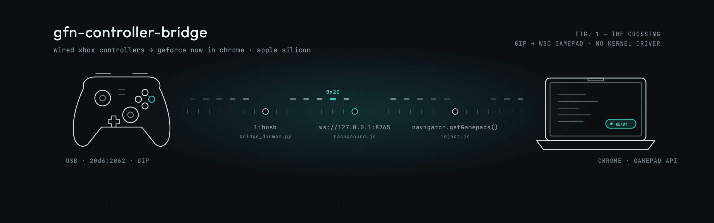
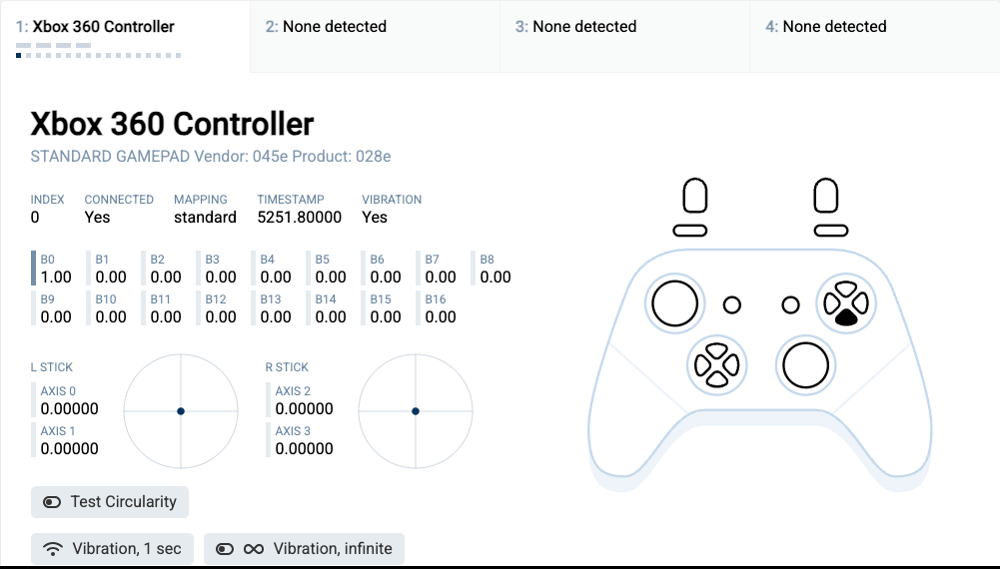
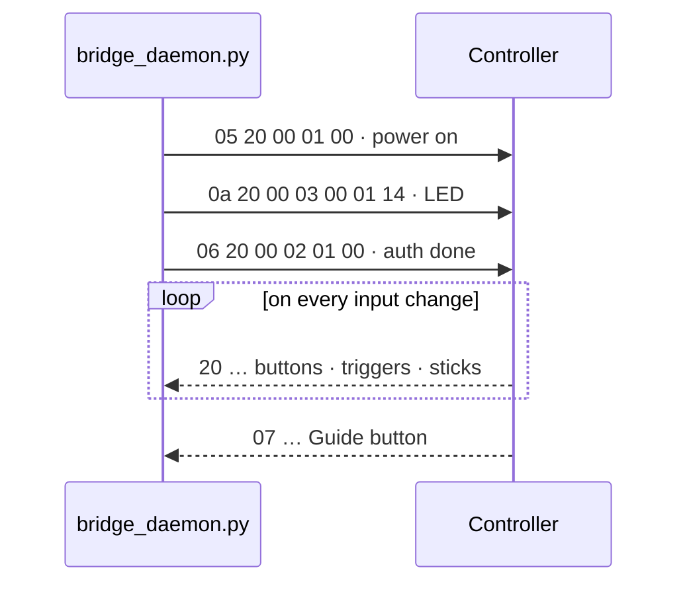
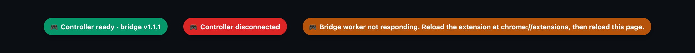

<p align="center">
  
</p>

<p align="center">
  <a href="LICENSE"></a>
  
  
  
  <a href="https://news.ycombinator.com/item?id=49666664"></a>
</p>

<p align="center">
  Plug in a wired Xbox controller, open <a href="https://play.geforcenow.com">play.geforcenow.com</a> in Chrome, play.<br>
  No kernel extension, no Bluetooth, no reduced-security mode.
</p>

---

## Why this exists

- **macOS has no USB driver for Xbox controllers.** They speak Microsoft's GIP protocol, not USB HID, and Apple only supports them over Bluetooth. Wired-only pads such as the PowerA Xbox Series X controller are invisible to every Mac app, including the native GeForce NOW client.
- **The old kext is gone.** [360Controller](https://github.com/360Controller/360Controller) never supported PowerA/PDP pads on macOS 10.11+ and cannot load on Apple Silicon without lowering system security.
- **GeForce NOW's web client only needs the Gamepad API.** If `navigator.getGamepads()` returns a `standard`-mapped pad, the game gets it. So this project talks GIP to the pad in userspace and hands the result to the browser.

<p align="center">
  
  <br><sub>hardwaretester.com seeing the bridged pad. The A press here came from the scripted test daemon; the live daemon does the same with the real controller.</sub>
</p>

## Quick start

Requirements: an Apple Silicon Mac, Homebrew `libusb`, Python 3.10+ with `websockets`, Google Chrome.

```bash
brew install libusb
python3 -m pip install websockets
git clone https://github.com/consigcody94/gfn-controller-bridge.git
cd gfn-controller-bridge
```

1. **Start the daemon** with the controller plugged in, and leave it running:

   ```bash
   ./start.sh
   ```

   `./start.sh --test` prints decoded buttons and sticks in the terminal instead of serving the WebSocket. Use it once to confirm the pad talks.

2. **Load the extension.** Open `chrome://extensions`, turn on **Developer mode**, click **Load unpacked**, choose the `extension/` folder.

3. **Check it.** Open <https://hardwaretester.com/gamepad>. The pad shows up as "Xbox 360 Controller (STANDARD GAMEPAD …)" and a green pill bottom-right reads *Controller ready · bridge v1.1.2*.

4. **Play.** Open <https://play.geforcenow.com> in Chrome and launch a game. The stream picks the pad up automatically.

> The native GeForce NOW app cannot see the controller. Only the web client can, because only a web page can be given a synthetic gamepad without a kernel driver.

## How it works

```mermaid
flowchart LR
  pad["Wired Xbox pad<br/><sub>USB · GIP · 20d6:2062</sub>"]
  daemon["bridge_daemon.py<br/><sub>libusb · interface 0</sub>"]
  bg["background.js<br/><sub>extension service worker</sub>"]
  cs["content.js<br/><sub>isolated world</sub>"]
  inj["inject.js<br/><sub>MAIN world</sub>"]
  gfn["play.geforcenow.com<br/><sub>streaming client</sub>"]
  pad -- "0x20 input reports" --> daemon
  daemon -- "ws://127.0.0.1:8765<br/>JSON · ~120 Hz" --> bg
  bg -- "runtime port<br/>changed frames only" --> cs
  cs -- "window.postMessage" --> inj
  inj -- "navigator.getGamepads()<br/>gamepadconnected" --> gfn
```



| Piece | What it does |
| --- | --- |
| `bridge_daemon.py` | Claims USB interface 0 with libusb, runs the GIP handshake, decodes `0x20` input reports (16-bit sticks, 10-bit triggers, button bitmask) and `0x07` Guide-button packets into W3C Gamepad shape, and broadcasts JSON over a local WebSocket. |
| `extension/background.js` | Owns the WebSocket. It has to live in the extension worker: Chrome 138+ blocks page-context `ws://127.0.0.1` from HTTPS sites (Local Network Access checks). Connects only while a matching tab is open and forwards only frames that changed. |
| `extension/content.js` | Isolated-world relay: extension port in, `window.postMessage` out. |
| `extension/inject.js` | Runs in the page's own JS context before any site script. Overrides `navigator.getGamepads()` with a fresh frozen snapshot per call, advances `timestamp` only on real changes, fires `gamepadconnected` / `gamepaddisconnected` exactly once per transition, and draws the status pill. |

### The GIP handshake

The daemon sends the same wake-up sequence the Linux `xpad` driver uses, then reads interrupt endpoint `0x81`:



### Status pill

<p align="center"></p>

| Pill | Meaning |
| --- | --- |
| **Controller ready · bridge vX.Y.Z** | Daemon connected and the worker answered the version handshake. Fades out after a few seconds. |
| **Controller disconnected** | The daemon stopped or the pad was unplugged. Reconnects on its own. |
| **Bridge worker not responding** | Chrome is still running an older copy of the extension's worker. See troubleshooting. |

## Troubleshooting

| Symptom | Cause | Fix |
| --- | --- | --- |
| Pill says *worker not responding* | After editing an unpacked extension, Chrome keeps the cached service worker. Restarting Chrome does **not** refresh it. | Click the Reload arrow on the extension card in `chrome://extensions`, then reload the game tab. |
| Green pill, but the game ignores the pad | The game tab was loaded before the extension was (re)loaded, so nothing was injected into it. | Reload the tab and relaunch the stream. |
| No pill at all | The site is not in the manifest's `matches`, or the extension is disabled. | Check `chrome://extensions`. |
| Daemon prints *Waiting for controller* | Pad not detected or its VID/PID is not in `SUPPORTED_DEVICES`. | Check `system_profiler SPUSBDataType`; add the pair to the list at the top of `bridge_daemon.py`. |
| Daemon connects but nothing moves | Another process holds the USB interface (some peripheral utilities open every device). | Quit it, replug the pad, restart the daemon. |
| Need a different daemon address | The worker reads `wsUrl` from extension storage. | In the worker console: `chrome.storage.local.set({wsUrl: 'ws://127.0.0.1:8766'})`. |

## Testing

`tools/test.mjs` drives Chrome for Testing over the DevTools protocol (no npm dependencies, Node 22+). It loads the extension into a fresh profile, checks hardwaretester.com and play.geforcenow.com against the live daemon, then swaps in `tools/fake_daemon.py` to prove button, trigger and axis propagation plus disconnect and reconnect handling. 25 checks, about 90 seconds.

```bash
npx @puppeteer/browsers install chrome@stable   # once, if no Chrome for Testing is cached
node tools/test.mjs
```

Branded Chrome 137+ no longer honours `--load-extension`, which is why the harness uses Chrome for Testing.

## FAQ

<details>
<summary><b>Will this make the pad work in the native GeForce NOW app, Steam, or other Mac apps?</b></summary>
No. Those read gamepads through macOS, and macOS has no driver for GIP over USB. Creating a system-wide virtual gamepad needs Apple's restricted DriverKit HID entitlement. For system-wide use you need a hardware USB-host-to-HID bridge, for example an RP2040 board running GP2040-CE.
</details>

<details>
<summary><b>Why not a Tampermonkey userscript instead of an extension?</b></summary>
A page-context WebSocket to <code>ws://127.0.0.1</code> from an HTTPS site fails in Chrome 138+ with <code>ERR_BLOCKED_BY_LOCAL_NETWORK_ACCESS_CHECKS</code>. Extension service workers are exempt, so the socket has to live there.
</details>

<details>
<summary><b>Which controllers work?</b></summary>
Any GIP pad that answers the standard wake-up sequence. Verified with the PowerA Xbox Series X Wired Controller (<code>20d6:2062</code>). Several other PowerA and Microsoft VID/PID pairs are pre-listed in <code>bridge_daemon.py</code>; add yours if it is missing.
</details>

<details>
<summary><b>Does rumble work?</b></summary>
Not yet. <code>vibrationActuator</code> is accepted so games do not break, but effects are ignored. GIP rumble is a single <code>0x09</code> packet, so this is a small addition.
</details>

<details>
<summary><b>Why does the page see an "Xbox 360 Controller"?</b></summary>
That id string is what Chrome reports for a standard-mapped Xbox pad, and GeForce NOW keys its button glyphs off it. The mapping is the W3C standard layout, so every button lands where the game expects.
</details>

## Roadmap

- Rumble passthrough (`vibrationActuator.playEffect` → GIP `0x09`)
- A launchd agent so the daemon starts at login
- Share button on Series X|S pads
- More VID/PID pairs from real-world reports

## Project layout

```
bridge_daemon.py     libusb → GIP → WebSocket daemon
start.sh             runs the daemon (add --test for a terminal readout)
extension/           MV3 Chrome extension (manifest, background, content, inject)
tools/               Chrome for Testing harness and scripted fake daemon
docs/assets/         banner and figure sources plus rendered PNGs
docs/design/         the visual language behind the artwork
```

## Credits

GIP packet layout and the wake-up sequence follow the Linux `xpad` driver. hardwaretester.com is the reference Gamepad API viewer used throughout.

## License

MIT, see [LICENSE](LICENSE).
